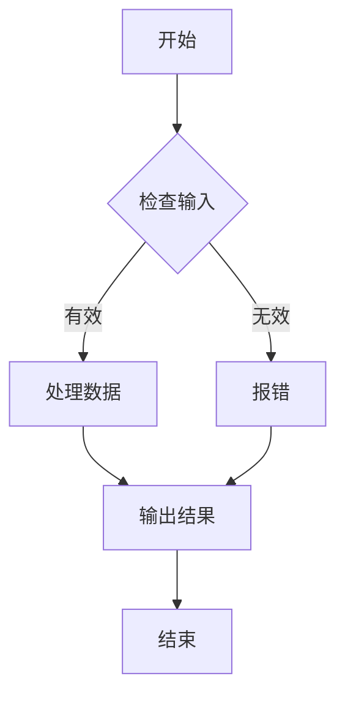
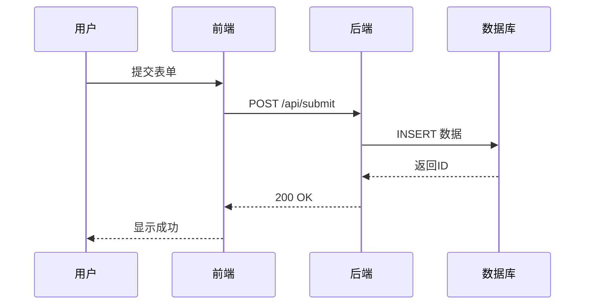

# Mermaid 图表生成

一图胜千言。当您阅读一篇复杂的技术文档、梳理一个系统的架构逻辑、或者试图理解一段多层嵌套的代码时，一张清晰的图表往往比长篇文字更能直击要点。GPT Academic 的 Mermaid 图表生成功能正是为此而生——它能够分析您的对话内容或上传的文档，自动提取关键信息并生成结构化的可视化图表。无论是流程图、序列图、类图还是思维导图，AI 都能为您选择最合适的呈现方式。

---

## 什么是 Mermaid

Mermaid 是一种基于文本的图表绘制语言，它允许您用简洁的代码语法描述图表结构，然后自动渲染为精美的可视化图形。与传统的绘图工具相比，Mermaid 的最大优势在于：图表的「源代码」是纯文本的，这意味着它可以被 AI 轻松生成和修改，也可以方便地嵌入到 Markdown 文档、GitHub README 或网页中。

GPT Academic 内置了 Mermaid 渲染引擎，AI 生成的 Mermaid 代码会直接在对话区渲染为可视化图表，您无需安装任何额外工具即可预览效果。如果图表过于复杂导致渲染不完整，您也可以将代码复制到在线 Mermaid 编辑器（如 [mermaid.live](https://mermaid.live)）中进行调整。

---

## 支持的图表类型

系统支持九种常用的图表类型，每种类型都有其独特的适用场景：

| 图表类型 | 标识符 | 适用场景 |
|---------|--------|---------|
| 流程图 | `flowchart` | 描述工作流程、决策逻辑、步骤顺序 |
| 序列图 | `sequenceDiagram` | 展示对象之间的交互顺序、API 调用流程 |
| 类图 | `classDiagram` | 描述类之间的关系、系统架构 |
| 饼图 | `pie` | 展示数据占比、分类统计 |
| 甘特图 | `gantt` | 项目进度规划、任务时间线 |
| 状态图 | `stateDiagram` | 描述状态机、生命周期、状态转换 |
| 实体关系图 | `erDiagram` | 数据库设计、实体关系建模 |
| 象限图 | `quadrantChart` | 分类对比、优先级矩阵 |
| 思维导图 | `mindmap` | 知识梳理、头脑风暴、概念关联 |

默认情况下，系统会让 AI 根据内容特点自动选择最合适的图表类型（思维导图除外，需手动指定）。如果您对自动选择的结果不满意，也可以在插件参数中明确指定想要的图表类型。

---

## 基本使用

Mermaid 图表生成功能可以从两个来源提取内容：当前的对话历史，或者您上传的文档文件。

### 从对话生成图表

当您与 AI 进行了一段有实质内容的讨论后（例如讨论了一个系统的工作原理、梳理了某个流程的步骤），可以直接基于这段对话生成图表。

操作非常简单：在函数插件区找到**对话**分类，点击**生成多种 Mermaid 图表**插件。系统会首先遍历对话历史，提取每个片段的核心内容形成摘要；接着，AI 会根据摘要的特点判断适合哪种图表类型；最后，生成对应的 Mermaid 代码并渲染显示。

整个过程可能需要几十秒到几分钟不等，具体取决于对话长度和所选模型的响应速度。过程中对话区会实时显示进度和中间结果。

<!-- IMAGE: feat_conv_01_mermaid_result.png -->
<!-- 描述: Mermaid 图表生成的完整结果展示，包含 AI 生成的图表 -->
<!-- 标注: ① 输入区（可为空或包含文件路径）② 生成的 Mermaid 图表（渲染后的可视化效果）③ 可展开查看的 Mermaid 源代码 -->
<!-- 尺寸建议: 1000px -->

### 从文件生成图表

除了对话历史，您还可以上传文档让系统分析并生成图表。目前支持以下格式：

- **PDF 文件**（`.pdf`）：学术论文、技术文档
- **Word 文件**（`.docx`）：报告、规范文档
- **Markdown 文件**（`.md`）：README、技术博客

使用方式是将文件上传到系统，在输入框中输入文件路径（或直接留空，系统会自动识别上传的文件），然后点击 Mermaid 图表生成插件。系统会先提取文件内容，再按照与对话生成相同的流程进行分析和图表绘制。

!!! tip "多文件处理"
    如果您上传的路径下包含多个符合条件的文件，系统会依次处理每个文件并分别生成图表。这在您需要批量可视化多篇文档时非常实用。

---

## 指定图表类型

有时候您可能已经明确知道想要什么类型的图表，或者希望尝试不同的可视化方式。这时可以使用插件的参数功能来手动指定图表类型。

点击插件按钮后，系统会弹出配置面板，其中「绘制的 Mermaid 图表类型」下拉菜单提供了以下选项：

| 选项 | 说明 |
|-----|------|
| 由 LLM 决定 | 默认选项，AI 自动判断最合适的图表类型（不包括思维导图）|
| 流程图 | 强制生成流程图 |
| 序列图 | 强制生成序列图 |
| 类图 | 强制生成类图 |
| 饼图 | 强制生成饼图 |
| 甘特图 | 强制生成甘特图 |
| 状态图 | 强制生成状态图 |
| 实体关系图 | 强制生成实体关系图 |
| 象限提示图 | 强制生成象限图 |
| 思维导图 | 强制生成思维导图 |

选择具体的图表类型后，系统会跳过类型判断步骤，直接使用该类型对应的 Prompt 模板让 AI 生成图表。这不仅能节省一次 API 调用，还能确保得到您期望的可视化形式。

!!! info "关于思维导图"
    在自动判断模式下，AI 往往会认为「思维导图」最能概括各种内容，导致其他图表类型很少被选中。因此，自动模式故意排除了思维导图选项。如果您确实需要思维导图，请手动在下拉菜单中选择它。

---

## 图表类型详解

不同类型的图表适用于不同的场景，选择恰当的图表类型能让信息传达更加高效。

### 流程图

流程图是最通用的图表类型，适合描述任何具有步骤或分支的过程。当您讨论的内容涉及「先做什么，再做什么」、「如果满足条件则执行 A，否则执行 B」这类逻辑时，流程图是理想的选择。

### 序列图

序列图专门用于展示多个参与者之间的交互顺序，特别适合描述 API 调用流程、通信协议、或者系统组件之间的消息传递。图中的垂直轴代表时间顺序，水平方向展示不同的参与者。

### 类图

类图来源于 UML（统一建模语言），用于描述类的结构和类之间的关系。在软件架构设计、面向对象分析，或者解释代码结构时非常有用。

### 饼图

饼图用于展示各部分占整体的比例，适合呈现统计数据、市场份额、时间分配等具有「占比」概念的信息。

### 甘特图

甘特图以时间轴的形式展示项目进度，每个任务用水平条表示，条的长度代表任务持续时间。它是项目管理中规划和跟踪进度的经典工具。

### 状态图

状态图描述了一个对象在其生命周期中可能经历的各种状态，以及触发状态转换的事件。订单状态、用户账号状态、连接状态等都适合用状态图来表达。

### 实体关系图

实体关系图（ER 图）是数据库设计的基础，它展示了数据实体及其之间的关系。当您讨论数据模型、表结构设计时，ER 图能清晰地呈现整体架构。

### 思维导图

思维导图以放射状结构展示概念之间的关联，从中心主题向外延伸出分支。它特别适合知识梳理、头脑风暴、或者文章大纲的可视化。

---

## 使用技巧

**内容要有结构性**：AI 生成图表的质量很大程度上取决于原始内容的结构性。如果您的对话或文档中已经包含了明确的步骤、分类、关系描述，生成的图表会更加准确。相反，如果内容是散乱的，AI 可能需要做更多的推断，结果的准确性也会下降。

**先提炼再生成**：对于很长的对话或文档，可以先让 AI 帮您总结要点，确认总结内容无误后，再基于总结生成图表。这种两步法通常能得到更精炼的图表。

**适时调整和迭代**：生成的图表可能不是一次就完美的。您可以查看 Mermaid 源代码，复制到在线编辑器中手动调整，或者用自然语言告诉 AI「请把 XX 节点的名称改为 YY」来微调结果。

**复杂图表的处理**：当内容非常复杂时，生成的图表可能节点过多导致渲染困难。这时建议将内容拆分为多个主题，分别生成图表，或者选择更简洁的图表类型（如思维导图）来概括核心脉络。

---

## 常见问题

???+ question "图表渲染不完整或显示异常"
    这通常是因为生成的图表过于复杂，超出了页面渲染的限制。您可以：
    
    1. 展开对话中的代码块，复制 Mermaid 源代码
    2. 访问 [mermaid.live](https://mermaid.live) 在线编辑器
    3. 粘贴代码进行查看和调整
    
    在线编辑器通常能处理更复杂的图表，还支持导出为 PNG/SVG 图片。

???+ question "AI 选择的图表类型不合适"
    在自动判断模式下，AI 可能会选择一个不太符合您预期的图表类型。解决方法很简单：重新调用插件时，在配置面板的下拉菜单中手动指定您想要的图表类型即可。

???+ question "生成的图表内容不准确"
    图表内容的准确性取决于 AI 对原始内容的理解。如果发现有偏差，您可以：
    
    - 在原始内容中补充更明确的结构描述
    - 在对话中直接指出需要修正的地方，让 AI 重新生成
    - 手动编辑 Mermaid 代码进行调整

???+ question "为什么自动模式不会选择思维导图？"
    实验发现，AI 在判断图表类型时对思维导图有明显的偏好——几乎任何内容它都认为思维导图是「最合适的」。为了让其他图表类型有机会被选中，自动模式故意排除了思维导图。如果您确实需要思维导图，请在配置面板中手动选择。

???+ question "支持中文内容吗？"
    完全支持。您可以用中文进行对话或上传中文文档，生成的图表节点文字也会是中文。Mermaid 语法本身对中文有良好的支持，只需确保文字内容用引号包裹即可正确渲染。

---

## 相关文档

- [基础功能](../basic_functions.md) — 了解 GPT Academic 内置的基础功能按钮
- [源码分析](../programming/code_analysis.md) — 分析代码项目，生成结构图
- [虚空终端](../agents/void_terminal.md) — 用自然语言指挥 AI 生成图表
- [对话保存与载入](conversation_save.md) — 保存包含图表的对话记录

